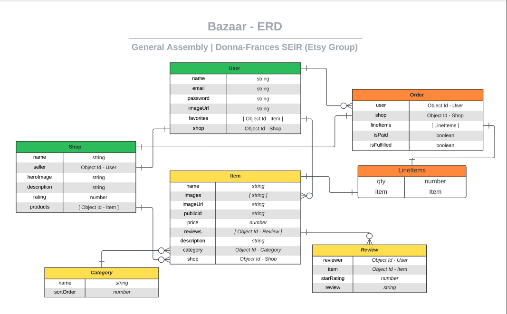
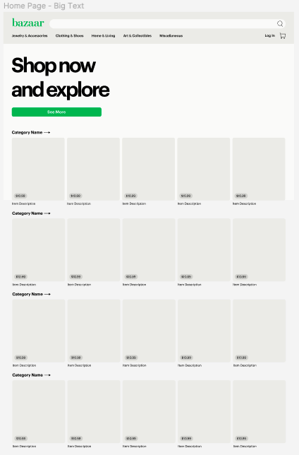
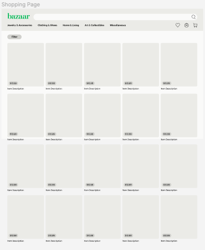
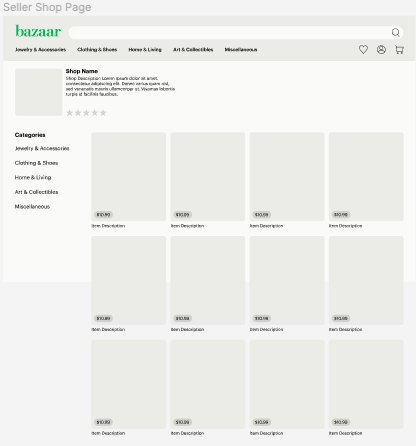
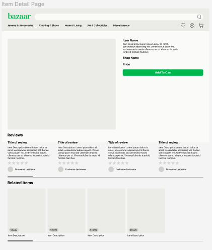
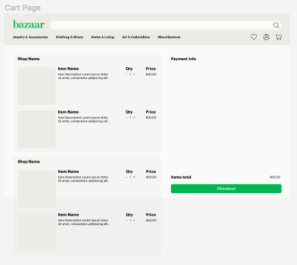
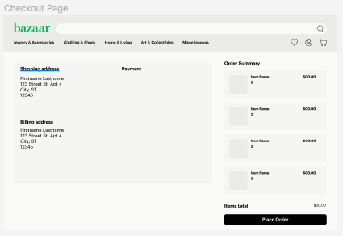
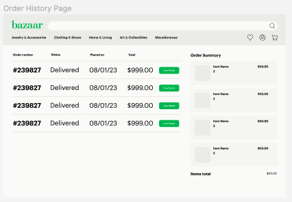
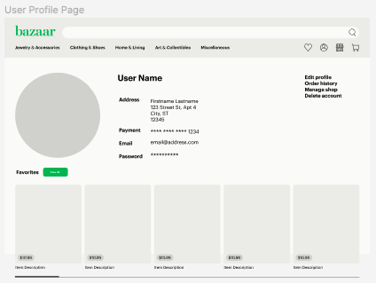
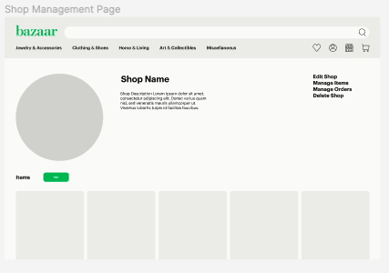

# General Assembly Group Capstone Project (Donna/Frances Cohort)
- Instructor: Arthur Bernier Jr
- Instructional Assistants: (Donna) Teo Marcelo and Joshu Miller, (Frances) August McConnel and Magnardo Tavarez
- Team Etsy: 
    - Avary Mitchell | [github](https://github.com/Anmitchell) | [linkedIn](https://www.linkedin.com/in/avary-mitchell-6b493612a/)
    - Brendan Mohan | [github](https://github.com/MoHanSolo) | [linkedIn](https://www.linkedin.com/in/brendan-mohan/)
    - Hailey Sellars (Scrum Master) | [github](https://github.com/hlysllrs) | [linkedIn](https://www.linkedin.com/in/hailey-sellars/)
    - Jacob Zagorenko | [github](https://github.com/Jacob1635) | [linkedIn](https://www.linkedin.com/in/jacob-zagorenko/)
    - Jamie Boeing | [github](https://github.com/JamieBoeing) | [linkedIn](https://www.linkedin.com/in/jamie-boeing/)
    - Joezari Borlongan (github Tzar) | [github](https://github.com/joe-bor) | [linkedIn]()
    - Michael Terry | [github](https://github.com/m-j-terry) | [linkedIn](https://www.linkedin.com/in/michaeljterry/)
    - Nick Daly | [github](https://github.com/ndaly94) | [linkedIn](https://www.linkedin.com/in/nickdaly94/)
- Project Scope: Using all of the skills you have gained over the ()span of your Software Engineering Intensive, create a fullstack application that functions like Etsy. 

# Live Link
- We proudly present our rendition of Etsy: 
## ✨[Bazaar](INSERT_LIVE_LINK_HERE)✨.

# ________________________________________________________

## SERVICES AND TECHNOLOGYIES USED

- digitalOcean: developer-ready site hosting service
- cloudinary: online image hosting api
- mongoDb: backend database for storing user, shop, item, category, review, and order documents
- favicon: design a website's 'thumbnail' tab image

### DEPENDENCIES

- bcrypt: Password encryption
- cloudinary: Image hosting api
- cors: Cross-origin request handler
- dotenv: Processes .env variables
- express: connects frontend application with backend api
- express-fileupload: middleware that enables file uploads (used with cloudinary to host uploaded images)
- jsonwebtoken: enables jwt authentication
- mongoose: creates models for backend documents
- morgan: http request logger
- serve-favicon: enables personalized thumbnail favicons to be used in browser tab

### DEV DEPENDENCIES

- auto-prefixer: automatically adds CSS prefixes
- babel: translates between jsx and es5 or es6
- bootstrap: frontend framework
- browser-sync: live css reload for ease in styling
- gulp: task optimizer 
- react: state-based frontend development tool
- react-router-dom: enables page routing in react applications
- sass: modulated stylesheets 
- webpack: compiles modules to be served in the browser

## ERD

## USER STORIES
- Click [here](https://github.com/users/MoHanSolo/projects/2/views/1) to view our user stories.

## TASKS
- Click [here](https://github.com/users/hlysllrs/projects/2/views/1) to see the division of tasks.

## WIREFRAMES
### Home Page

### Shop Page

### Seller Shop Page

### Item Detail Page

### Cart Page

### Checkout Page

### Order History Page

### User Profile Page

### Favorites Page

### Shop Management Page

